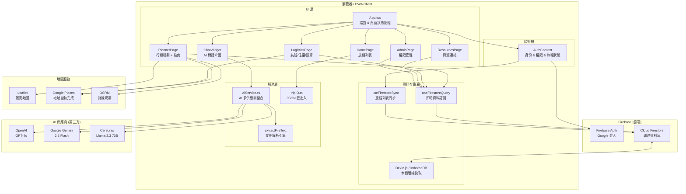
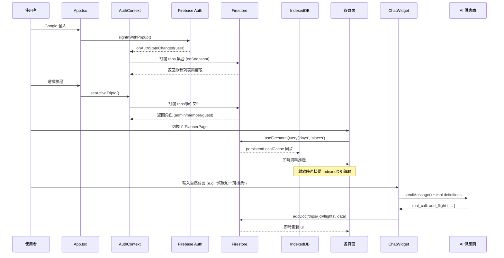
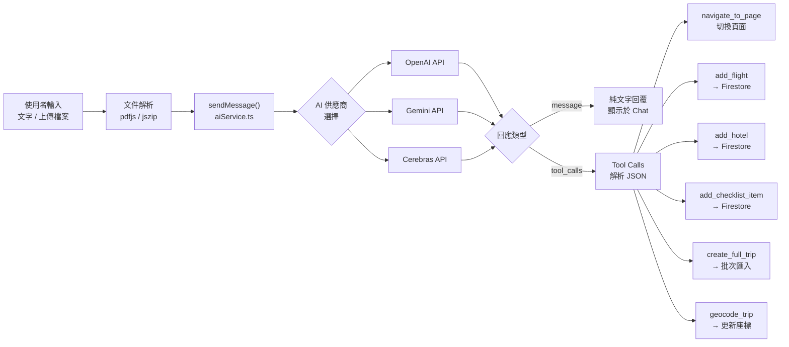

# 旅遊儀表板 (Travel Dashboard) 技術文件

## 專案概述

- **專案名稱**: travel-dashboard
- **框架與建置**: React 19, TypeScript, Vite
- **PWA (漸進式網頁應用程式)**: 使用 VitePWA 提供離線優先 (Offline-first) 支援，並具備靜態資源快取能力。
- **地圖與拖曳互動**: Leaflet, React Leaflet, Vis.gl React Google Maps, Dnd-kit

## 系統架構圖 (Architecture Diagrams)

### 高層次系統架構 (High-Level System Architecture)

---

### 資料流程圖 (Data Flow)

---

### AI 工具呼叫流程 (AI Tool Calling Flow)

---

## 系統架構與狀態管理

### 1. 資料儲存與同步 (Data Layer)
- **Firebase Firestore**: 作為主要雲端資料儲存平台，具有即時同步功能。資料結構主要圍繞在 `trips` 集合及其子集合 (`flights`, `hotels`, `checklistItems` 等)。
- **Dexie.js (IndexedDB)**: 在本地端使用 IndexedDB 存取資料，以支援無網路狀態下的流暢操作。
- **離線狀態監控**: 在 `App.tsx` 中實作 `offline` 與 `online` 事件監聽，並顯示離線 UI 狀態。

### 2. 身份認證與權限控制 (Auth & Authorization)
- **Firebase Auth**: 支援 Google 帳號登入 (`GoogleAuthProvider`)。
- **角色權限機制**: 系統根據使用者權限區分為不同的角色（例如：`admin`, `planner`, `logistics`, `resources`），控制是否可以讀取或寫入特定頁面。

## 主要模組與頁面 (Pages)

- **HomePage (`src/pages/HomePage.tsx`)**: 旅程列表首頁，可用來切換或建立新旅程。
- **PlannerPage (`src/pages/PlannerPage.tsx`)**: 核心的行程規劃頁面，支援使用拖曳 (Drag & Drop) 的方式來調整每日景點。
- **LogisticsPage (`src/pages/LogisticsPage.tsx`)**: 行前準備頁面，包含航班、住宿、票券清單以及花費預算等資訊管理。
- **ResourcesPage (`src/pages/ResourcesPage.tsx`)**: 提供給團隊成員放置外部連結或相關文件參考的資源頁面。
- **AdminPage (`src/pages/AdminPage.tsx`)**: 管理人員權限、分享設定及系統設定專用頁面。

## AI 助理整合架構 (AI Agent Integration)

本專案 (`src/services/aiService.ts`) 內建強大的 AI 代理功能，具有以下特色：

### 1. 多模型供應商支援 (Multi-Provider)
系統支援讓使用者在本地端存取 API Key，切換多種主流模型：
- **OpenAI**: GPT-4o, GPT-4o-mini 等
- **Gemini**: Gemini 2.5 Flash, Gemini 2.0 Flash 等
- **Cerebras**: Llama 3.3 70B 等超高速推論模型

### 2. 內建工具呼叫 (Function Calling / Tools)
AI 可自動辨識意圖並透過 Tool Calls 控制應用程式：
- `navigate_to_page`: 協助使用者在系統內自動切換頁面。
- `add_flight` / `add_hotel` / `add_checklist_item`: 從自然語言中擷取資訊並自動加入至 Firestore 記錄。
- `create_full_trip`: 處理極長的文字或檔案內容，自動切分並產生一份完整的 JSON 行程表，包含每日行程、住宿及航班。
- `geocode_trip`: 批次呼叫 AI 進行文字轉經緯度 (Geocoding) 查詢。

### 3. 多格式檔案解析 (Document Parsing)
前端支援直接讀取並解析各種文件格式，方便使用者上傳旅行社 PDF 或自製的 Word/Excel 行程表並餵給 AI：
- **PDF**: 透過 `pdfjs-dist` 提取文字。
- **Office**: 透過 `jszip` 解析 `.docx`, `.pptx`, `.xlsx` 的底層 XML。
- **Text/Markdown/CSV**: 直接讀取純文字。

## 部署與環境配置

- 專案相依環境變數 (需設定於 `.env` 中):
  - `VITE_FIREBASE_API_KEY`
  - `VITE_FIREBASE_AUTH_DOMAIN`
  - `VITE_FIREBASE_PROJECT_ID`
  - `VITE_FIREBASE_STORAGE_BUCKET`
  - `VITE_FIREBASE_MESSAGING_SENDER_ID`
  - `VITE_FIREBASE_APP_ID`
- 專案的 Vite 設定包含 `VitePWA`，會自動將 Google Fonts 與 Maps API 加入本機快取策略 (`CacheFirst` 與 `NetworkFirst`)。
